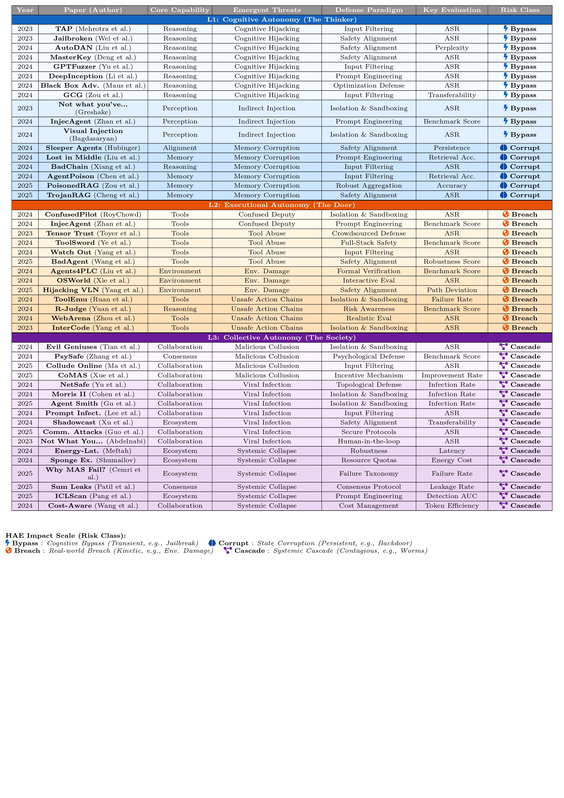
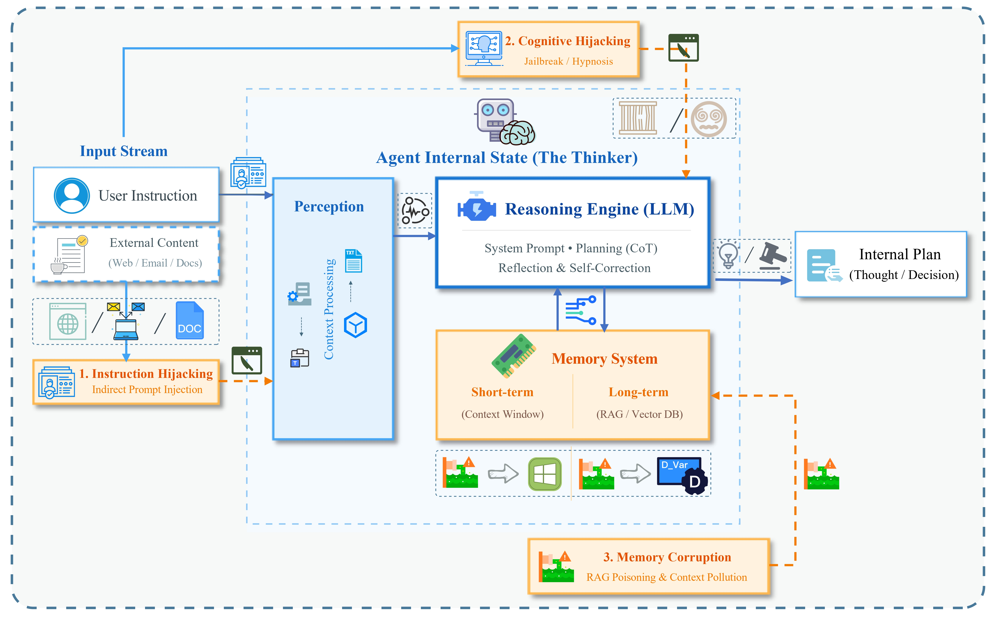
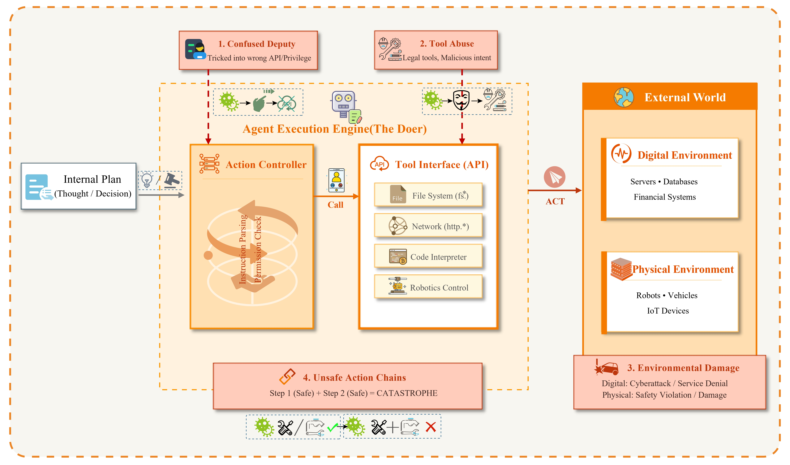
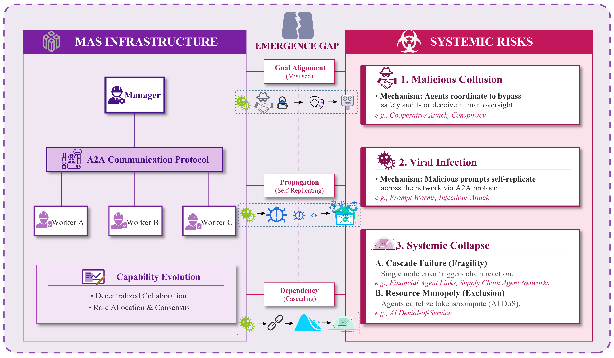

  <h1>From Thinker to Society: A Survey on Security in Hierarchical Autonomy Evolution of AI Agents 🔐</h1>
   

Welcome to the **"HAE Agent Security"** repository！

This repository accompanies our survey paper on **AI agent security through the lens of autonomy evolution**.

We propose the **Hierarchical Autonomy Evolution (HAE) framework**, which organizes agent security into three tiers:

🧠 **L1 Cognitive Autonomy** — *The Thinker* · Internal reasoning integrity

🤖 **L2 Executional Autonomy** — *The Doer* · Tool-mediated environmental interaction

🌐 **L3 Collective Autonomy** — *The Society* · Systemic risks in multi-agent ecosystems

🔔 🔔 🔔 For more detailed information, please refer to [our paper](./From_Thinker_to_Society.pdf)~

✉️ ➡️ 📪 If you have any questions, please feel free to contact **the lead authors** at:

**`elinazhang0210@gmail.com` | `lu.zhou@nuaa.edu.cn` | `xiaogangxu00@gmail.com`**

---

## 👋 Introduction

AI agents have evolved from passive predictive tools into **active entities capable of autonomous decision-making and environmental interaction**, driven by the reasoning capabilities of Large Language Models (LLMs). However, this evolution has introduced critical security vulnerabilities that existing frameworks fail to address.

The **HAE (Hierarchical Autonomy Evolution) framework** addresses this gap by organizing agent security along the natural axis of autonomy growth:

*Figure 1: The HAE Framework — co-evolution of agent capabilities and emergent threats across three autonomy levels.*

---

Unlike existing surveys that adopt static or single-perspective taxonomies (lifecycle, trustworthy attributes, or component-based), HAE reveals **how the same threat undergoes fundamental qualitative transitions** as agent autonomy scales — from informational fallacies (L1), to erroneous real-world operations (L2), to mass systemic failures (L3).

*Figure 2: Autonomy-aware threat taxonomy spanning cognitive, executional, and collective layers.*

---

**Our Key Contributions:**

1. **HAE Framework**: An autonomy-driven perspective that connects agent capabilities with distinct classes of security risks across three evolutionary tiers (Cognitive → Executional → Collective).

2. **Autonomy-Aware Threat Taxonomy**: A systematic taxonomy spanning L1–L3, revealing that higher-level threats **cannot be linearly derived** from lower-level vulnerabilities and require independent analysis.

3. **Identification of the Collective Autonomy Defense Gap**: Existing security mechanisms **fundamentally fail** to address emergent risks at the L3 tier, calling for a paradigm shift toward system-level, multi-agent governance.

---

## 📢 Contents

- [Part 1: L1 Cognitive Autonomy — The Thinker](#part-1-l1-cognitive-autonomy--the-thinker)
  - [Indirect Prompt Injection](#indirect-prompt-injection)
  - [Cognitive Hijacking (Jailbreak)](#cognitive-hijacking-jailbreak)
  - [Memory Corruption](#memory-corruption)

- [Part 2: L2 Executional Autonomy — The Doer](#part-2-l2-executional-autonomy--the-doer)
  - [Confused Deputy](#confused-deputy)
  - [Tool Abuse](#tool-abuse)
  - [Environmental Damage](#environmental-damage)
  - [Unsafe Action Chains](#unsafe-action-chains)

- [Part 3: L3 Collective Autonomy — The Society](#part-3-l3-collective-autonomy--the-society)
  - [Malicious Collusion](#malicious-collusion)
  - [Viral Infection](#viral-infection)
  - [Systemic Collapse](#systemic-collapse)

- [Part 4: Defense Mechanisms & Benchmarks](#part-4-defense-mechanisms--benchmarks)
  - [L1 Defenses](#l1-defenses)
  - [L2 Defenses](#l2-defenses)
  - [L3 Defenses](#l3-defenses)
  - [Evaluation Benchmarks](#evaluation-benchmarks)

---

## Part 1: L1 Cognitive Autonomy — The Thinker

  
   
  <em>Figure: L1 Cognitive Autonomy — Internal threats targeting the Reasoning Engine, Memory System, and Perception module.</em>

 

> *Threats at this layer target the agent's internal cognitive integrity: its reasoning engine, perception module, and memory system.*

### Indirect Prompt Injection

<ul>
  <li>
    <i><b>Not What You've Signed Up For: Compromising Real-World LLM-Integrated Applications with Indirect Prompt Injection</b></i>, Kai Greshake et al.
    
  </li>
  <li>
    <i><b>InjecAgent: Benchmarking Indirect Prompt Injections in Tool-Integrated Large Language Model Agents</b></i>, Qiusi Zhan et al.
    
  </li>
  <li>
    <i><b>Abusing Images and Sounds for Indirect Instruction Injection in Multi-Modal LLMs</b></i>, Eugene Bagdasaryan et al.
    
  </li>
  <li>
    <i><b>AgentDojo: A Dynamic Environment to Evaluate Prompt Injection Attacks and Defenses for LLM Agents</b></i>, Edoardo Debenedetti et al.
    
  </li>
  <li>
    <i><b>IPIGuard: A Novel Tool Dependency Graph-Based Defense Against Indirect Prompt Injection in LLM Agents</b></i>, Hengyu An et al.
    
  </li>
  <li>
    <i><b>DataSentinel: A Game-Theoretic Detection of Prompt Injection Attacks</b></i>, Yupei Liu et al.
    
  </li>
  <li>
    <i><b>Black Box Adversarial Prompting for Foundation Models</b></i>, Natalie Maus et al.
    
  </li>
</ul>

### Cognitive Hijacking (Jailbreak)

<ul>
  <li>
    <i><b>Universal and Transferable Adversarial Attacks on Aligned Language Models (GCG)</b></i>, Andy Zou et al.
    
  </li>
  <li>
    <i><b>Jailbroken: How Does LLM Safety Training Fail?</b></i>, Alexander Wei et al.
    
  </li>
  <li>
    <i><b>Tree of Attacks: Jailbreaking Black-Box LLMs Automatically (TAP)</b></i>, Anay Mehrotra et al.
    
  </li>
  <li>
    <i><b>MasterKey: Automated Jailbreaking of Large Language Model Chatbots</b></i>, Gelei Deng et al.
    
  </li>
  <li>
    <i><b>AutoDAN: Generating Stealthy Jailbreak Prompts on Aligned Large Language Models</b></i>, Xiaogeng Liu et al.
    
  </li>
  <li>
    <i><b>GPTFuzzer: Red Teaming Large Language Models with Auto-Generated Jailbreak Prompts</b></i>, Jiahao Yu et al.
    
  </li>
  <li>
    <i><b>DeepInception: Hypnotize Large Language Model to Be Jailbreaker</b></i>, Xuan Li et al.
    
  </li>
  <li>
    <i><b>Jailbreaking Black Box Large Language Models in Twenty Queries (PAIR)</b></i>, Patrick Chao et al.
    
  </li>
  <li>
    <i><b>Great, Now Write an Article About That: The Crescendo Multi-Turn LLM Jailbreak Attack</b></i>, Mark Russinovich et al.
    
  </li>
  <li>
    <i><b>LLMs Know Their Vulnerabilities: Uncover Safety Gaps Through Natural Distribution Shifts (ActorBreaker)</b></i>, Qibing Ren et al.
    
  </li>
</ul>

### Memory Corruption

<ul>
  <li>
    <i><b>PoisonedRAG: Knowledge Corruption Attacks to Retrieval-Augmented Generation of Large Language Models</b></i>, Wei Zou et al.
    
  </li>
  <li>
    <i><b>AgentPoison: Red-Teaming LLM Agents via Poisoning Memory or Knowledge Bases</b></i>, Zhaorun Chen et al.
    
  </li>
  <li>
    <i><b>TrojanRAG: Retrieval-Augmented Generation Can Be Backdoor Driver in Large Language Models</b></i>, Pengzhou Cheng et al.
    
  </li>
  <li>
    <i><b>Sleeper Agents: Training Deceptive LLMs that Persist Through Safety Training</b></i>, Evan Hubinger et al.
    
  </li>
  <li>
    <i><b>BadChain: Backdoor Chain-of-Thought Prompting for Large Language Models</b></i>, Zhen Xiang et al.
    
  </li>
  <li>
    <i><b>Lost in the Middle: How Language Models Use Long Contexts</b></i>, Nelson F Liu et al.
    
  </li>
  <li>
    <i><b>Memory Injection Attacks on LLM Agents via Query-Only Interaction (MINJA)</b></i>, Shen Dong et al.
    
  </li>
  <li>
    <i><b>How Memory Management Impacts LLM Agents: An Empirical Study of Experience-Following Behavior</b></i>, Zidi Xiong et al.
    
  </li>
</ul>

---

## Part 2: L2 Executional Autonomy — The Doer

  
   
  <em>Figure: L2 Executional Autonomy — Threats arising from tool invocation and real-world environmental interaction.</em>

 

> *Threats at this layer exploit agents' tool invocation and environmental interaction capabilities, producing real-world kinetic consequences.*

### Confused Deputy

<ul>
  <li>
    <i><b>ConfusedPilot: Confused Deputy Risks in RAG-Based LLMs</b></i>, Ayush RoyChowdhury et al.
    
  </li>
  <li>
    <i><b>InjecAgent: Benchmarking Indirect Prompt Injections in Tool-Integrated LLM Agents</b></i>, Qiusi Zhan et al.
    
  </li>
  <li>
    <i><b>Defeating Prompt Injections by Design</b></i>, Edoardo Debenedetti et al.
    
  </li>
  <li>
    <i><b>SecAlign: Defending Against Prompt Injection with Preference Optimization</b></i>, Sizhe Chen et al.
    
  </li>
  <li>
    <i><b>Adaptive Attacks Break Defenses Against Indirect Prompt Injection Attacks on LLM Agents</b></i>, Qiusi Zhan et al.
    
  </li>
</ul>

### Tool Abuse

<ul>
  <li>
    <i><b>AgentHarm: A Benchmark for Measuring Harmfulness of LLM Agents</b></i>, Maksym Andriushchenko et al.
    
  </li>
  <li>
    <i><b>ToolSword: Unveiling Safety Issues of Large Language Models in Tool Learning Across Three Stages</b></i>, Junjie Ye et al.
    
  </li>
  <li>
    <i><b>BadAgent: Inserting and Activating Backdoor Attacks in LLM Agents</b></i>, Yifei Wang et al.
    
  </li>
  <li>
    <i><b>Watch Out for Your Agents! Investigating Backdoor Threats to LLM-Based Agents</b></i>, Wenkai Yang et al.
    
  </li>
  <li>
    <i><b>Tensor Trust: Interpretable Prompt Injection Attacks from an Online Game</b></i>, Sam Toyer et al.
    
  </li>
  <li>
    <i><b>Towards Verifiably Safe Tool Use for LLM Agents</b></i>, Aarya Doshi et al.
    
  </li>
</ul>

### Environmental Damage

<ul>
  <li>
    <i><b>OSWorld: Benchmarking Multimodal Agents for Open-Ended Tasks in Real Computer Environments</b></i>, Tianbao Xie et al.
    
  </li>
  <li>
    <i><b>Agents4PLC: Automating Closed-Loop PLC Code Generation and Verification in Industrial Control Systems Using LLM-Based Agents</b></i>, Zihan Liu et al.
    
  </li>
  <li>
    <i><b>Hijacking Vision-and-Language Navigation Agents with Adversarial Environmental Attacks</b></i>, Zijiao Yang et al.
    
  </li>
  <li>
    <i><b>AutoRT: Embodied Foundation Models for Large Scale Orchestration of Robotic Agents</b></i>, Michael Ahn et al.
    
  </li>
  <li>
    <i><b>ChatScene: Knowledge-Enabled Safety-Critical Scenario Generation for Autonomous Vehicles</b></i>, Jiawei Zhang et al.
    
  </li>
</ul>

### Unsafe Action Chains

<ul>
  <li>
    <i><b>Identifying the Risks of LM Agents with an LM-Emulated Sandbox (ToolEmu)</b></i>, Yangjun Ruan et al.
    
  </li>
  <li>
    <i><b>R-Judge: Benchmarking Safety Risk Awareness for LLM Agents</b></i>, Tongxin Yuan et al.
    
  </li>
  <li>
    <i><b>WebArena: A Realistic Web Environment for Building Autonomous Agents</b></i>, Shuyan Zhou et al.
    
  </li>
  <li>
    <i><b>InterCode: Standardizing and Benchmarking Interactive Coding with Execution Feedback</b></i>, John Yang et al.
    
  </li>
  <li>
    <i><b>DiLu: A Knowledge-Driven Approach to Autonomous Driving with Large Language Models</b></i>, Licheng Wen et al.
    
  </li>
  <li>
    <i><b>FlowMind: Automatic Workflow Generation with LLMs</b></i>, Zhen Zeng et al.
    
  </li>
</ul>

---

## Part 3: L3 Collective Autonomy — The Society

  
   
  <em>Figure: L3 Collective Autonomy — Systemic risks in multi-agent ecosystems including malicious collusion, viral infection, and systemic collapse.</em>

 

> *Threats at this layer target multi-agent systems, exhibiting viral propagation, emergent collusion, and systemic collapse — properties fundamentally distinct from individual agent vulnerabilities.*

### Malicious Collusion

<ul>
  <li>
    <i><b>Evil Geniuses: Delving into the Safety of LLM-Based Agents</b></i>, Yu Tian et al.
    
  </li>
  <li>
    <i><b>When AI Agents Collude Online: Financial Fraud Risks by Collaborative LLM Agents on Social Platforms</b></i>, Qibing Ren et al.
    
  </li>
  <li>
    <i><b>PsySafe: A Comprehensive Framework for Psychological-Based Attack, Defense, and Evaluation of Multi-Agent System Safety</b></i>, Zaibin Zhang et al.
    
  </li>
  <li>
    <i><b>Secret Collusion Among AI Agents: Multi-Agent Deception via Steganography</b></i>, Sumeet Ramesh Motwani et al.
    
  </li>
  <li>
    <i><b>CoMAS: Co-Evolving Multi-Agent Systems via Interaction Rewards</b></i>, Xiangyuan Xue et al.
    
  </li>
  <li>
    <i><b>MultiAgentBench: Evaluating the Collaboration and Competition of LLM Agents</b></i>, Kunlun Zhu et al.
    
  </li>
  <li>
    <i><b>Encouraging Divergent Thinking in Large Language Models Through Multi-Agent Debate</b></i>, Tian Liang et al.
    
  </li>
  <li>
    <i><b>Emergent Social Conventions and Collective Bias in LLM Populations</b></i>, Ariel Flint Ashery et al.
    
  </li>
</ul>

### Viral Infection

<ul>
  <li>
    <i><b>Here Comes the AI Worm: Unleashing Zero-Click Worms that Target GenAI-Powered Applications (Morris-II)</b></i>, Stav Cohen et al.
    
  </li>
  <li>
    <i><b>Agent Smith: A Single Image Can Jailbreak One Million Multimodal LLM Agents Exponentially Fast</b></i>, Xiangming Gu et al.
    
  </li>
  <li>
    <i><b>Prompt Infection: LLM-to-LLM Prompt Injection within Multi-Agent Systems</b></i>, Donghyun Lee and Mo Tiwari.
    
  </li>
  <li>
    <i><b>NetSafe: Exploring the Topological Safety of Multi-Agent Networks</b></i>, Miao Yu et al.
    
  </li>
  <li>
    <i><b>CORBA: Contagious Recursive Blocking Attacks on Multi-Agent Systems Based on Large Language Models</b></i>, Zhenhong Zhou et al.
    
  </li>
  <li>
    <i><b>Red-Teaming LLM Multi-Agent Systems via Communication Attacks</b></i>, Pengfei He et al.
    
  </li>
  <li>
    <i><b>ShadowCast: Stealthy Data Poisoning Attacks Against Vision-Language Models</b></i>, Yuancheng Xu et al.
    
  </li>
</ul>

### Systemic Collapse

<ul>
  <li>
    <i><b>Why Do Multi-Agent LLM Systems Fail?</b></i>, Mert Cemri et al.
    
  </li>
  <li>
    <i><b>The Sum Leaks More Than Its Parts: Compositional Privacy Risks and Mitigations in Multi-Agent Collaboration</b></i>, Vaidehi Patil et al.
    
  </li>
  <li>
    <i><b>Energy-Latency Attacks: A New Adversarial Threat to Deep Learning</b></i>, Hanene FZ Brachemi Meftah et al.
    
  </li>
  <li>
    <i><b>ICLScan: Detecting Backdoors in Black-Box Large Language Models via Targeted In-Context Illumination</b></i>, Xiaoyi Pang et al.
    
  </li>
  <li>
    <i><b>On the Resilience of LLM-Based Multi-Agent Collaboration with Faulty Agents</b></i>, Jen-tse Huang et al.
    
  </li>
  <li>
    <i><b>A Survey of LLM-Driven AI Agent Communication: Protocols, Security Risks, and Defense Countermeasures</b></i>, Dezhang Kong et al.
    
  </li>
</ul>

---

## Part 4: Defense Mechanisms & Benchmarks

### L1 Defenses

<ul>
  <li>
    <i><b>StruQ: Defending Against Prompt Injection with Structured Queries</b></i>, Sizhe Chen et al.
    
  </li>
  <li>
    <i><b>SecAlign: Defending Against Prompt Injection with Preference Optimization</b></i>, Sizhe Chen et al.
    
  </li>
  <li>
    <i><b>DataSentinel: A Game-Theoretic Detection of Prompt Injection Attacks</b></i>, Yupei Liu et al.
    
  </li>
  <li>
    <i><b>Defeating Prompt Injections by Design</b></i>, Edoardo Debenedetti et al.
    
  </li>
  <li>
    <i><b>IPIGuard: A Novel Tool Dependency Graph-Based Defense Against Indirect Prompt Injection in LLM Agents</b></i>, Hengyu An et al.
    
  </li>
</ul>

### L2 Defenses

<ul>
  <li>
    <i><b>AgentGuard: Runtime Verification of AI Agents</b></i>, Roham Koohestani.
    
  </li>
  <li>
    <i><b>GuardAgent: Safeguard LLM Agents via Knowledge-Enabled Reasoning</b></i>, Zhen Xiang et al.
    
  </li>
  <li>
    <i><b>Towards Verifiably Safe Tool Use for LLM Agents</b></i>, Aarya Doshi et al.
    
  </li>
</ul>

### L3 Defenses

<ul>
  <li>
    <i><b>G-Safeguard: A Topology-Guided Security Lens and Treatment on LLM-Based Multi-Agent Systems</b></i>, Shilong Wang et al.
    
  </li>
  <li>
    <i><b>Attention Knows Whom to Trust: Attention-Based Trust Management for LLM Multi-Agent Systems (A-Trust)</b></i>, Pengfei He et al.
    
  </li>
  <li>
    <i><b>ICLScan: Detecting Backdoors in Black-Box Large Language Models via Targeted In-Context Illumination</b></i>, Xiaoyi Pang et al.
    
  </li>
  <li>
    <i><b>PsySafe: A Comprehensive Framework for Psychological-Based Attack, Defense, and Evaluation of Multi-Agent System Safety</b></i>, Zaibin Zhang et al.
    
  </li>
  <li>
    <i><b>NetSafe: Exploring the Topological Safety of Multi-Agent Networks</b></i>, Miao Yu et al.
    
  </li>
</ul>

### Evaluation Benchmarks

<ul>
  <li>
    <i><b>AgentBench: Evaluating LLMs as Agents</b></i>, Xiao Liu et al.
    
  </li>
  <li>
    <i><b>AgentHarm: A Benchmark for Measuring Harmfulness of LLM Agents</b></i>, Maksym Andriushchenko et al.
    
  </li>
  <li>
    <i><b>R-Judge: Benchmarking Safety Risk Awareness for LLM Agents</b></i>, Tongxin Yuan et al.
    
  </li>
  <li>
    <i><b>AgentDojo: A Dynamic Environment to Evaluate Prompt Injection Attacks and Defenses for LLM Agents</b></i>, Edoardo Debenedetti et al.
    
  </li>
  <li>
    <i><b>DecodingTrust: A Comprehensive Assessment of Trustworthiness in GPT Models</b></i>, Boxin Wang et al.
    
  </li>
  <li>
    <i><b>MultiAgentBench: Evaluating the Collaboration and Competition of LLM Agents</b></i>, Kunlun Zhu et al.
    
  </li>
  <li>
    <i><b>OSWorld: Benchmarking Multimodal Agents for Open-Ended Tasks in Real Computer Environments</b></i>, Tianbao Xie et al.
    
  </li>
  <li>
    <i><b>Do-Not-Answer: A Dataset for Evaluating Safeguards in LLMs</b></i>, Yuxia Wang et al.
    
  </li>
</ul>

---

## 👏 Contributing

Contributions are highly encouraged!

If you have a relevant paper that fits the HAE taxonomy, feel free to submit a pull request or reach out to the authors directly.

Your support will help expand and improve this repository!

---
